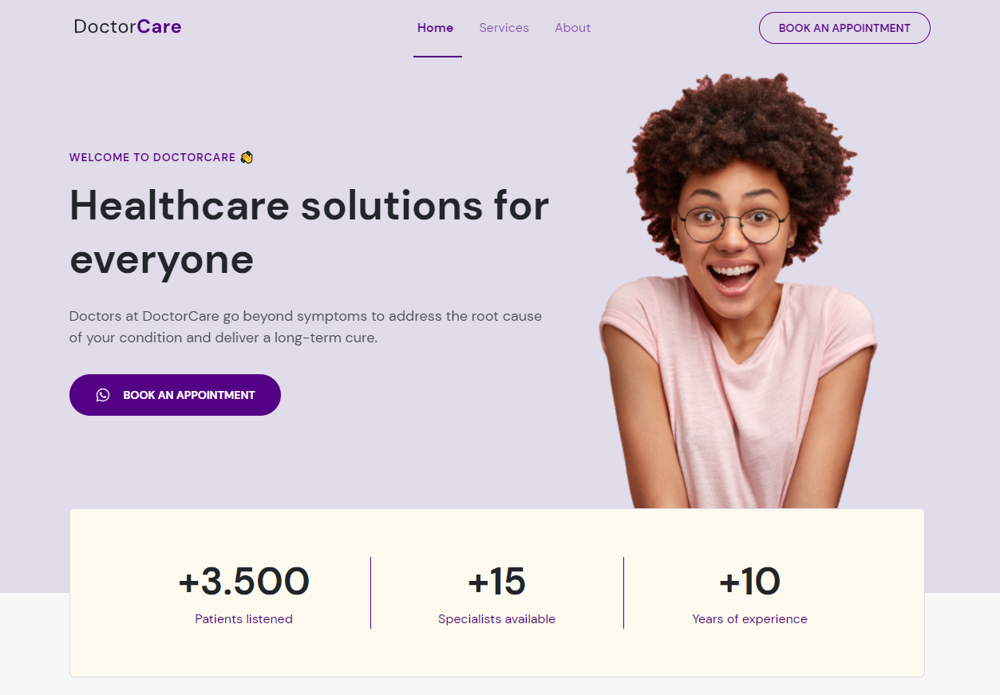
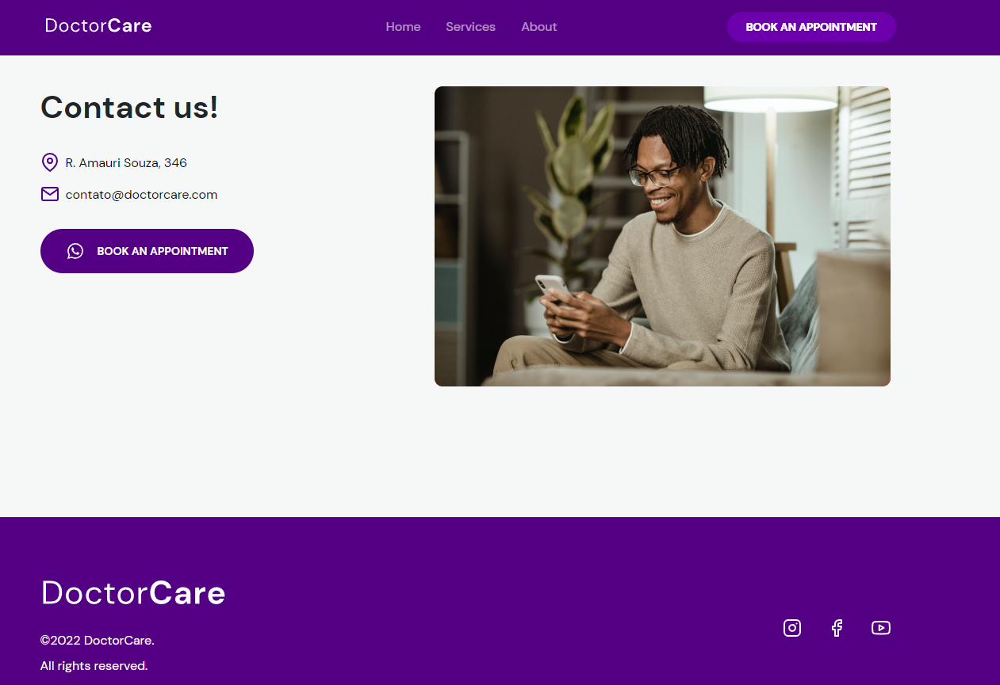
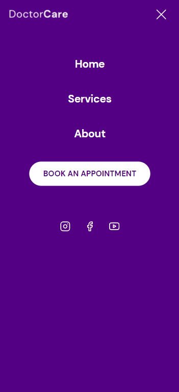
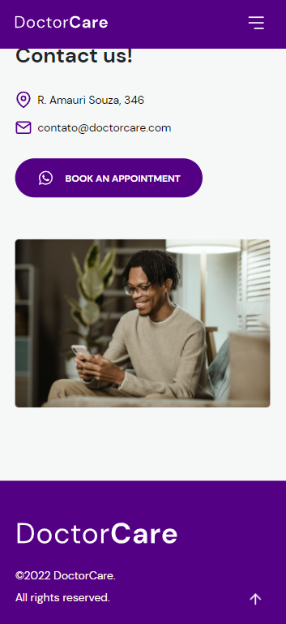

# Bruno Nunes Borges 

## Hello!  Welcome to my profile!!

I'm a full stack developer with a great passion for web development!

- :rocket: Technical skills and interests: JS/TS, HTML & CSS, NodeJS, ReactJS, React Native, AWS, Docker, MongoDB.
- 🌱 I’m currently learning NodeJS and React Native to become a full-stack developer!
- 👯 I’m looking to collaborate on React and Node projects that captivate me.
- 😄 Trying to practice clean architecture knowledge to create a quality and scalable code.

<h1 align="center">
  
</h1>

<strong>
 

  <a href="#bookmark-about">About</a>&nbsp;&nbsp;&nbsp;|&nbsp;&nbsp;&nbsp;
  <a href="#computer-technologies">Technologies</a>&nbsp;&nbsp;&nbsp;|&nbsp;&nbsp;&nbsp;
  <a href="#wrench-tools">Tools</a>&nbsp;&nbsp;&nbsp;|&nbsp;&nbsp;&nbsp;
  <a href="#package-installation">Installation</a>&nbsp;&nbsp;&nbsp;|&nbsp;&nbsp;&nbsp;
  <a href="#camera_flash-videos">Videos</a>&nbsp;&nbsp;&nbsp;|&nbsp;&nbsp;&nbsp;
  <a href="#camera_flash-screenshots">Screenshots</a>&nbsp;&nbsp;&nbsp;|&nbsp;&nbsp;&nbsp;
  <a href="#memo-license">License</a>

</strong>
 

    

## :bookmark: About

**HouseFinder** is a tool that aims to assist in finding vacancies in properties with a simple but modern and sophisticated usability.

 

## :computer: Technologies

-  **[HTML]**
-  **[CSS]**
-  **[JavaScript]**
-  **[Vercel]**

 

## :wrench: Tools

- **[VisualStudio Code]**
- **[Figma]**

 

## :camera_flash: Screenshots

- Web

- Mobile

&nbsp;&nbsp;&nbsp;

 

## :memo: License

